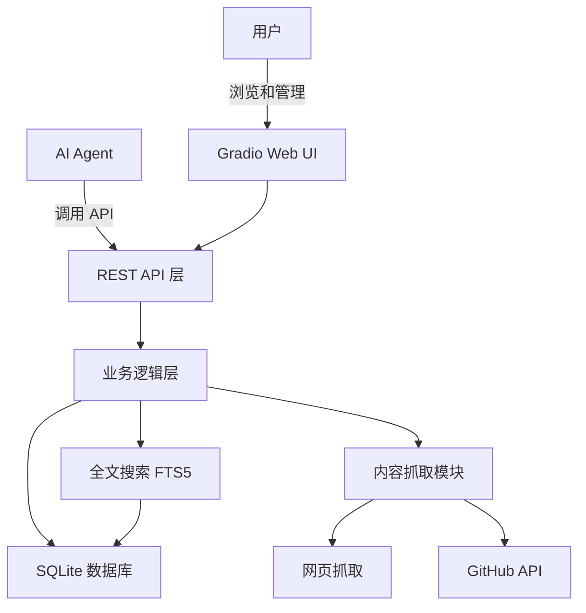

# 知识库管理工具

Feature Name: knowledge-base-tool
Updated: 2026-05-14

## Description

一个基于 Python + SQLite 的知识库管理工具，提供 REST API 供 AI Agent 调用，同时提供 Gradio Web 界面供用户直观浏览和管理知识库。支持三种内容类型入库（URL 链接、教程文案、GitHub 项目），具备全文搜索、标签分类、内容抓取辅助等功能。

## Architecture



系统采用四层架构：

1. **Gradio Web UI**: 提供直观的可视化界面，支持浏览、搜索、创建和管理条目
2. **REST API 层**: 使用 FastAPI 框架提供 HTTP 接口
3. **业务逻辑层**: 处理条目 CRUD、搜索、标签管理
4. **数据层**: SQLite + FTS5 全文搜索引擎

## Components and Interfaces

### 1. Gradio Web UI

提供用户友好的可视化界面，包含以下功能页面：

**主页 - 知识库概览**
- 显示知识库统计信息（总条目数、各类型数量、标签云）
- 最近添加的条目列表（最近 10 条）
- 快速搜索框

**搜索与浏览页**
- 关键词搜索框，支持实时搜索
- 类型过滤器（全部/URL/教程/GitHub）
- 标签过滤器（多选）
- 结果列表以卡片形式展示，显示标题、简介、类型标签、创建时间
- 点击卡片展开详情

**创建条目页**
- 选择内容类型（URL/教程文案/GitHub）
- 根据类型显示不同表单：
  - URL: 输入网址，自动抓取标题
  - 教程: 输入标题和粘贴文案内容
  - GitHub: 输入仓库地址，自动获取 README
- 提交后显示创建结果

**条目详情页**
- 完整显示条目信息
- 编辑标题、简介、标签
- 查看原始内容
- 删除条目

**标签管理页**
- 显示所有标签及对应条目数
- 点击标签筛选相关条目

Gradio 服务默认运行在端口 7860，与 FastAPI 服务共享同一进程或独立启动。

### 2. FastAPI 应用

启动 HTTP 服务，监听默认端口 8000，提供以下路由：

| 方法 | 路径 | 描述 |
|------|------|------|
| POST | `/api/entries` | 创建新条目 |
| GET | `/api/entries` | 列出条目（支持分页） |
| GET | `/api/entries/{id}` | 获取条目详情 |
| PUT | `/api/entries/{id}` | 更新条目 |
| DELETE | `/api/entries/{id}` | 删除条目 |
| GET | `/api/entries/search` | 搜索条目 |
| GET | `/api/entries/{id}/content` | 获取条目原始内容（供 Agent 抓取） |
| POST | `/api/entries/{id}/summary` | 更新条目简介 |
| GET | `/api/tags` | 获取所有标签 |

### 2. 数据库模型

```
Entry:
  - id: INTEGER PRIMARY KEY
  - title: TEXT (标题)
  - url: TEXT (原始 URL，可选)
  - content_type: TEXT (url/tutorial/github)
  - raw_content: TEXT (原始内容，供 Agent 生成简介)
  - summary: TEXT (Agent 生成的简介)
  - tags: TEXT (JSON 数组存储标签)
  - status: TEXT (pending/processed/deleted)
  - created_at: TIMESTAMP
  - updated_at: TIMESTAMP
```

### 4. 内容抓取模块

- **网页抓取**: 使用 `httpx` + `trafilatura` 提取网页正文
- **GitHub 抓取**: 使用 GitHub REST API 获取仓库信息和 README

### 5. 全文搜索模块

使用 SQLite FTS5 虚拟表，对 `title`、`summary`、`raw_content`、`tags` 建立全文索引。

## Data Models

### EntryCreate (请求体)

```json
{
  "url": "https://...",           // 可选，URL 类型必填
  "content_type": "url|tutorial|github",
  "raw_content": "...",           // 可选，tutorial 类型必填
  "title": "..."                  // 可选，未提供时从 URL 提取
}
```

### EntryUpdate (请求体)

```json
{
  "title": "...",
  "summary": "...",
  "tags": ["tag1", "tag2"],
  "url": "..."
}
```

### EntryResponse (响应体)

```json
{
  "id": 1,
  "title": "...",
  "url": "https://...",
  "content_type": "url",
  "summary": "...",
  "tags": ["tag1", "tag2"],
  "status": "processed",
  "created_at": "2026-05-14T10:00:00",
  "updated_at": "2026-05-14T10:00:00"
}
```

### SearchResponse (响应体)

```json
{
  "total": 10,
  "page": 1,
  "page_size": 20,
  "items": [EntryResponse, ...]
}
```

## Correctness Properties

1. 每个条目必须有唯一的 ID（自增主键）
2. `content_type` 必须是 `url`、`tutorial`、`github` 之一
3. 删除操作使用软删除（status 标记为 deleted），不物理删除数据
4. 搜索关键词至少匹配 title、summary、tags、url 中的一个字段
5. 标签数组在存储前必须去重
6. 分页参数 page >= 1, page_size 范围 1-100

## Error Handling

| 错误场景 | 处理方式 |
|----------|----------|
| 无效的 content_type | 返回 400 + 错误信息 |
| 条目不存在 | 返回 404 |
| 数据库连接失败 | 返回 500 + 错误信息 |
| 内容抓取超时 | 返回错误信息，条目标记为异常 |
| 搜索关键词为空 | 返回空结果集 |
| 标签格式错误 | 返回 400 + 错误信息 |

## Test Strategy

1. **单元测试**: 使用 pytest 测试数据库操作、搜索逻辑、标签处理
2. **API 测试**: 使用 httpx 测试客户端验证所有 API 端点
3. **集成测试**: 验证完整工作流：创建条目 → 获取内容 → 更新简介 → 搜索
4. **边界测试**: 空数据库搜索、超长内容处理、特殊字符标签

## References

[^1]: FastAPI 官方文档 - https://fastapi.tiangolo.com/
[^2]: SQLite FTS5 文档 - https://www.sqlite.org/fts5.html
[^3]: httpx 文档 - https://www.python-httpx.org/
[^4]: trafilatura 文档 - https://trafilatura.readthedocs.io/
